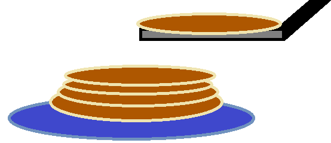

# Stacks

## Introduction and Uses

Detailed and organized coverage of the topic with documentation including diagrams

What is the purpose of the data structure?

What kind of problems can be solved using the data structure? undo functionality, remember history of what was added or typed, call stacks when programming and debugging (terminal error messages)

How would the data structure be used in Python?

Common Errors

A stack is a data structure that uses the first in last out method. This means that the first item added to the array will be the last one to be taken out of the array. Adding an item to the array will always put it at the very end and is called `pushing`. Removing and returning something from the array also will happen at the very end and is called `popping`. This can be compared to a stack of pancakes. The first pancake that you `push` or add onto the stack will be the last to be `popped` or removed from the stack.

A stack can be used for many different opperations, like ____.

| 3 |  |  |  |
| :------ | :-------- | :-------- | :------ |
|                                           |

| 3 | 5 |  |  |
| :------ | :-------- | :-------- | :------ |
|                                           |

| 3 | 5 | 2 |  |
| :------ | :-------- | :-------- | :------ |
|                                           |



## Important Concepts

## Efficiency
| Stack Operation | Code | Performance | Description |
| :---: | :---: | :---: | :---: |
| Push | stack.append(value) | O(1) | Add to end of array |
| Pop | value = stack.pop() | O(1) | Remove from end of array |
| Size | length = len(stack) | O(1) | Size of array |
| Empty | if len(stack) == 0 | O(1) | Check if size of array is empty | 

## Example Problem
After traveling for weeks the space station has finally come into sight! Man, if we mess up the docking phase... Well, let's just make sure that we don't. Good thing we have a list of spaceship docking steps! Now, how could we be sure that they would come out in the right order so we don't explode our new ship? We need a data structure that is ordered and lets us take out the information in a certain order. A stack should do the trick!

We will start with an empty list (stack) to create a docking procedure with. Because a stack allows us to take out the data in the opposite order that we put them in, we will be adding in the steps starting with the last step first.

```python
docking_procedure = []

docking_procedure.append("6. Depressurize docking bay")
docking_procedure.append("5. Engage locking mechanisms")
docking_procedure.append("4. Connect spaceship port to docking platform")
docking_procedure.append("3. Engage thrusters")
docking_procedure.append("2. Line up with space station docking platform")
docking_procedure.append("1. Maintain orbit with space station")
```

Now that the steps have all been added, we can remove them once they have been completed and stop once the stack is empty and there is nothing left to do.

```python
while len(docking_procedure) != 0:
  print(f"Completed: {docking_procedure[-1]}")
  docking_procedure.pop()
  
print("Docking Complete")
```

## Problem to Solve

You have delivered all of your cargo to the space station and your mission is halfway done. All you need to do now is get back home safely. Unfortunately, they forgot to tell you which launch code to use to reverse the direction you are going. Thankfully, the boss called in and told you that he wants you to use the most recent **even** launch code that was created and punch it in. But how can we know which one that was? With a stack we can remove the last item from the list and display it on the screen. Your mission is to get the launch code without exploding the ship.

Look here at the [starting code](https://github.com/katereclark/data_structures_tutorial/blob/main/launch_codes.py) to begin your mission, or you can copy and paste the code below. Once you are ready, you can check the answer here in the [solution code](https://github.com/katereclark/data_structures_tutorial/blob/main/launch_codes_solution.py).

```python
import random

launch_codes = ["45923", "12281", "70024", "34975", "20912", "54557", "71233", "62841"]

# Finds the most recent even launch code.
def determine_correct_launch_code(launch_codes):
  for code in reversed(launch_codes):
    if int(code) % 2 == 0:
      return code

print("Find the right code using the commands below.")
print("1. Push   - select and add random code")
print("2. Pop    - select and remove code")
print("3. Launch - use selected code")
print("4. Give up for now")

code = "11111"
command = input("> ")

while command != "4":
  correct_code = determine_correct_launch_code(launch_codes)
  # Adds a random launch code to the stack.
  if command == "1":
    code = str(random.randint(10000, 99999))

    # TODO: Push the code to the back of the launch_codes list.

    print("Random launch code added")
    print(f"Selected launch code: {code}")
    correct_code = determine_correct_launch_code(launch_codes)
    command = input("> ")
  # Removes and selects the last launch code from the stack.
  elif command == "2":
    
    # TODO: Pop the code from the back of the launch_codes list and select the code.

    print(f"Selected launch code: {code}")
    command = input("> ")
  # Checks if the launch codes match.
  elif command == "3":
    if code == correct_code:
      print("Launch successful!")
    else:
      print("Aaaaand now we're dead!")
    break
```

[Back to Welcome Page](https://github.com/katereclark/data_structures_tutorial/blob/main/0-welcome.md)
