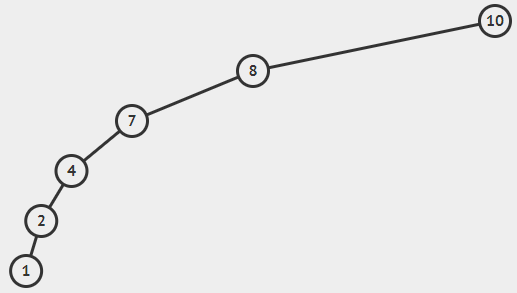
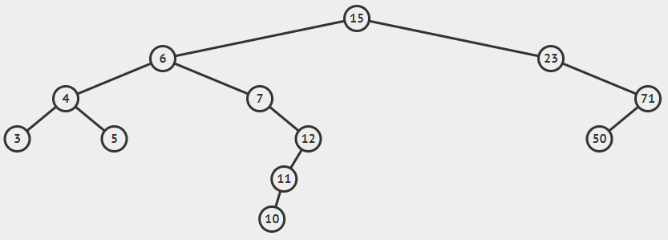

# Trees

## Introduction and Uses

A **tree** is a data structure that uses nodes (like the branch points on a physical tree) that are linked together using pointers. A **binary tree** is a tree that can only have up to two child nodes per subtree. A **subtree** is the child nodes to the left and right of the parent node. The first node at the top of the tree is called the **root**. A node that doesn't link to any children is called a **leaf**. A **binary search tree (BST)** is a binary tree where there are specific instructions for where to insert data. With a BST, you have to add the data that is less than the parent node to the left and the data that is greater than the parent node to the right. You can also insert data that is equal to the parent node to the right if you are okay with there being duplicates in your tree. This makes sure that the tree is able to be sorted.

As an example, we will create a root with the number 5 in it.


The parent node is 5 and we know that 2 is less than 5, so we add as a child node to the left of the parent node. Since 11 is greater than 5, we add it to the right of the parent node.


If we want to add the number 4 to the tree, we start at the root and work our way down. 4 is less than 5, so we move to the right. 4 is greater than 2 and 2 is a leaf (no child nodes) so we can stop searching for an open spot and add 4 to the right of 2 as a child node. 2 is the parent node of 4 now, so we now have another subtree.


In order to add the number 3, we start at the root and see that 3 is less than 5, so we move to the right. We then see that 3 is greater than 2, so we move to the right again. 3 is less than 4 and 4 doesn't have any children so we know that we can insert 3 as a child node to the left of 4. To add 1, we would go from 5 to 2 and then add it to the left of 2. If we wanted to add an 8, we move from 5 to 11 and then see that 11 is a leaf. Since 8 is less than 11 we would add 8 to the left as a child node.


If we were to add more numbers the BST, we would need to follow these same rules with each number, always starting at the root and moving down. The red boxes are examples of some of the subtrees in this particular BST.


A binary search tree is very efficient when it comes to searching for a place to add a value or looking up a value. This is because it cuts the number of elements it has to go through before locating the value in half on average. This sure beats iterating through each item in a list. However, a BST can only be this efficient if it is balanced. If we were to add the values in a different order we could get something that looks just like a list and would have a performance of O(n) rather than O(log n) since it would have to iterate over each item in the BST instead of only going through about half of the items. Such a BST would look like this:



A **balanced binary search tree** is when the differences between the height of any two subtrees is not very large, which in the case of an **AVL tree** the height difference is less than 2. To calculate the height of a tree, count the maximum number of notes between the root and the leaves and add 1 for the root. This next tree would be considered unbalanced because the maximum height of any two trees would be 6 and 4 with a height difference of 2.



In order to balance this tree using the AVL method, we would need to rotate the nodes so that the 11 becomes the parent node of 10 and 12. This allows us to have O(log n) performance now that the tree is balanced since the heights are 5 and 4 with a difference of 1 rather than 2. 


## Recursion

Before we can go into how to use a binary search tree, we need to make sure that the concept of recursion is understood. **Recursion** is where a function calls itself. This can be dangerous, however, because this will result in a function calling itself forever unless we specify a situation where recursion would not be required. This stopping place is called a **base case**. A recursive function also needs to be called on a smaller version of the problem. In other words, we need to make sure that the problem we are trying to solve gets smaller with each recursive call so that it will eventually get to the base case and stop instead of going on forever. Here is an example with the recursion requirements labeled:

```python
count_down = 10

def system_check(count_down):
  # Base case: stops when the count down reaches 0.
  if count_down <= 0:
    print("System Check Completed.")
    return
  # Smaller problem: subtracts 1 from the count down with each call.
  else:
    print("Sytem Check In Progress...")
    system_check(count_down - 1)
```

## Important Concepts

How would the data structure be used in Python (in some cases you will need to discuss recursion)?

What kind of errors are common when using the data structure?

```python
class BST:
    class Node:

        # Initializes the node with the data and empty child nodes.
        def __init__(self, data):       
            self.data = data
            self.left = None
            self.right = None

    # Initializes the BST to be empty.
    def __init__(self):
        self.root = None

    # Inserts the data into the next open node unless the root is empty.
    def insert(self, data):
        # inserts the data into the root if it is empty.
        if self.root is None:
            self.root = BST.Node(data)
        else:
            self._insert(data, self.root)

    # Locates the next empty node and inserts the data into it.
    def _insert(self, data, node):
        # Data is smaller so goes on the left.
        if data < node.data:
            if node.left is None:
                # Inserts data into empty spot.
                node.left = BST.Node(data)
            else:
                # Keeps searching for empty spot recursively.
                self._insert(data, node.left)
        # Data is larger so it goes on the right.
        else:
            if node.right is None:
                # Inserts data into empty spot.
                node.right = BST.Node(data)
            else:
                # Keeps searching for empty spot recursively.
                self._insert(data, node.right)
```

## Efficiency

Recursion is used in these operations to search through each of the subtrees.

| BST Operation | Performance | Description |
| :---: | :---: | :--- |
| insert(value) | O(log n) | Finds empty spot to insert into using recursion |
| remove(value) | O(log n) | Finds the value to remove using recursion |
| contains(value) | O(log n) | Finds the value using recursion |
| traverse_forward | O(log n) | Traverses left and then right subtrees using recursion (smallest to largest) |
| traverse_reverse | O(log n) | Traverses right and then left subtrees using recursion (largest to smallest) |
| height(node) | O(log n) | Finds the height of left and right subtrees using recursion and returns maximum height (adding one for the root node) |
| size() | O(1) | Size of tree from BST class |
| empty() | O(1) | Checks if root node is empty or size is zero |

## Example Problem

We have added a few more alien species to our set since we stopped at another trading post on the way back to Earth. We are going to add all of the species from the set into the binary search tree to display them in alphabetical order. Our boss also asks us if we have any "ashtar" in our group of aliens so he can take some extra precautions before we get back to Earth.

In order to do this we will need to add an interator to our BST class. To accomplish this, we can write two functions: the `__iter__()` function and the `_traverse_forward()` function. The first one overrules the built in Python `__iter__()` function and the second tells it the specifics of what to do. Yield in Python not only returns a value but is also able to remember where it left off with every iteration so it is very valuable when recursing through trees.

```python 
# Iterates forward starting at the root, like in a for loop.
def __iter__(self):
    yield from self._traverse_forward(self.root)

# Keeps iterating forwared until runs into an empty node.
def _traverse_forward(self, node):
    if node is not None:
        # Returns the left node location.
        yield from self._traverse_forward(node.left)
        # Returns the data value.
        yield node.data
        # Remembers the right node location.
        yield from self._traverse_forward(node.right)
```

Now we can display the alien species in order and check to see if "ashtar" is in the group we are bringing back.

```python
alien_catalog = {"venusian", "irken", "ashtar", "silurian", "mothman", "sleestak", "grey", "saiyan", "nam", "plejaren", "martian"}

# Creates a BST.
alien_tree = BST()

# Inserts each species into the BST.
for species in alien_catalog:
  alien_tree.insert(species)

# Iterates over tree forwards.
for species in alien_tree:
    print(species)

# Checks if the ashtar is in the BST.
if "ashtar" in alien_tree:
  print("Ashtar is in the group.")
else:
  print("Ashtar was not found.")
```

## Problem to Solve

Our boss has now requested that we add the capability to reverse alphabetical order that the species are displayed in the system in case it is needed later. He would also like for us to add the ability to check the height of the tree to make sure that it is balanced.

Look here at the [starting code](https://github.com/katereclark/data_structures_tutorial/blob/main/alien_tree.py) to begin your task, or you can copy and paste the code below. Once you are ready, you can check the answer here in the [solution code](https://github.com/katereclark/data_structures_tutorial/blob/main/alien_tree_solution.py).

```python
class BST:
    class Node:
        def __init__(self, data):       
            self.data = data
            self.left = None
            self.right = None

    def __init__(self):
        self.root = None

    def insert(self, data):
        if self.root is None:
            self.root = BST.Node(data)
        else:
            self._insert(data, self.root)

    def _insert(self, data, node):
        if data < node.data:
            if node.left is None:
                node.left = BST.Node(data)
            else:
                self._insert(data, node.left)
        else:
            if node.right is None:
                node.right = BST.Node(data)
            else:
                self._insert(data, node.right)
                
    def __iter__(self):
        yield from self._traverse_forward(self.root)
        
    def _traverse_forward(self, node):
        if node is not None:
            yield from self._traverse_forward(node.left)
            yield node.data
            yield from self._traverse_forward(node.right)
            
    def __reversed__(self):
      yield from self._traverse_backward(self.root)
      
    def _traverse_backward(self, node):
    
        # TODO: Reverse the _traverse_forward() function to iterate backwards.
            
    def get_height(self):
        if self.root is None:
            return 0
        else:
            return self._get_height(self.root)

    def _get_height(self, node):
    
      # TODO: Check the height of the tree using the left and right node heights.
      
        if node == None:
            return 0
        # Recursively call the _get_height() function on the left and right nodes.
        else:
            left_height = None # Change this.
            right_height = None # Change this.
          
            if left_height > right_height:
                return left_height + 1
            else:
                return right_height + 1
  
alien_catalog = {"venusian", "irken", "ashtar", "silurian", "mothman", "sleestak", "grey", "saiyan", "nam", "plejaren", "martian"}

alien_tree = BST()

for species in alien_catalog:
    
    # TODO: Insert the species into the alien_tree.

for species in reversed(alien_tree):
    print(species)
    
print("Height: " + str(alien_tree.get_height())) # Will be 5.
```

[Back to Welcome Page](https://github.com/katereclark/data_structures_tutorial/blob/main/0-welcome.md)
